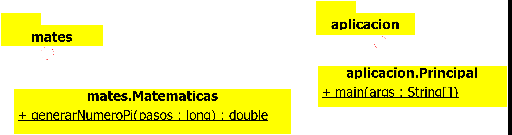

Copyright [2022] [Jesús Joana Azuara]
Licensed under the Apache License, Version 2.0 (the "License");
you may not use this file except in compliance with the License.
You may obtain a copy of the License at

        http://www.apache.org/licenses/LICENSE-2.06

Unless required by applicable law or agreed to in writing, software distributed Jesús Joana Azuarastributed on an "AS IS" BASIS, WITHOUT WARRANTIES OR CONDITIONS OF ANY KIND, either express or implied. See the License for the specific language governing permissions and limitations under the Licene.

# MonteCarloPi2022

# Practica1
Esta práctica consiste en la obtención del número Pi mediante el método de Montecarlo.
> El método de Montecarlo es un método no determinista o estadístico numérico, usado para aproximar expresiones matemáticas complejas y costosas con exactitud. El método se llamó así en referencia al Casino de Montecarlo (Mónaco) por ser "capital"del juego del azar, al ser la ruleta un generador simple de números aleatorios. El nombre y el desarrollo sistemático de los métodos de Montecarlo datan aproximadamente de 1944 y se mejoraron enormemente con el desarrollo de la computadora.
[enlace a wikipedia](https://es.wikipedia.org/wiki/Método_de_Montecarlo)

## Forma de utilizar este programa 

El máximo número de iteraciones permitidas por el programa son 2.147.483.647, ya que hemos definido la variable número de iteraciones como un número entero.
El programa no hemos hecho el control de excepciones para el caso en que el número de iteraciones introducidas por el usuario sea mayor que ese número.

## Comandos

- Elaboración Jar
```shell
make jar
```
- Elaboración Javadoc
```shell
make javadoc
```
- Aproximación Pi:
```shell
java -jar ap-Matematicas.jar 10000

"10000" marca el número de intentos a realizar para llevar a cabo la aproximación.
```

- Compilación código: 
```shell
make compilar
```


## Analisis de complejidad del método empleado
> La complejidad del algoritmo utilizado en este programa es "Complejidad lineal". Es una complejidad algoritmica muy usual. Aperece en la evaluación de bucles simples siempre que la complejidad de las instrucciones sea constante.
[enlace a wikipedia](https://monografias.com/trabajos27/complejidad-algoritmica/complejidad_algoritmica.shtml#complej)




